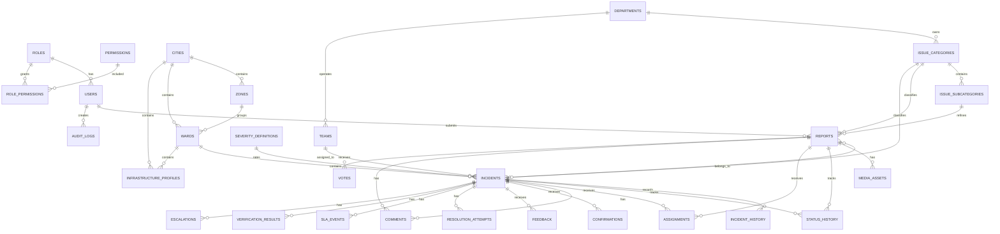

# Civic Issue Database ER Diagram

```mermaid
 erDiagram
  ROLES ||--o{ USERS : has
  ROLES ||--o{ ROLE_PERMISSIONS : grants
  PERMISSIONS ||--o{ ROLE_PERMISSIONS : included
  CITIES ||--o{ ZONES : contains
  CITIES ||--o{ WARDS : contains
  ZONES ||--o{ WARDS : groups
  DEPARTMENTS ||--o{ ISSUE_CATEGORIES : owns
  ISSUE_CATEGORIES ||--o{ ISSUE_SUBCATEGORIES : contains
  USERS ||--o{ REPORTS : submits
  ISSUE_CATEGORIES ||--o{ REPORTS : classifies
  ISSUE_SUBCATEGORIES ||--o{ REPORTS : refines
  REPORTS }o--o| INCIDENTS : belongs_to
  REPORTS ||--o{ MEDIA_ASSETS : has
  DEPARTMENTS ||--o{ TEAMS : operates
  TEAMS ||--o{ INCIDENTS : assigned_to
  ISSUE_CATEGORIES ||--o{ INCIDENTS : classifies
  WARDS ||--o{ INCIDENTS : contains
  SEVERITY_DEFINITIONS ||--o{ INCIDENTS : rates
  INCIDENTS ||--o{ INCIDENT_HISTORY : records
  INCIDENTS ||--o{ STATUS_HISTORY : tracks
  REPORTS ||--o{ STATUS_HISTORY : tracks
  INCIDENTS ||--o{ ASSIGNMENTS : receives
  REPORTS ||--o{ ASSIGNMENTS : receives
  INCIDENTS ||--o{ COMMENTS : has
  REPORTS ||--o{ COMMENTS : has
  REPORTS ||--o{ VOTES : receives
  INCIDENTS ||--o{ CONFIRMATIONS : receives
  INCIDENTS ||--o{ FEEDBACK : receives
  INCIDENTS ||--o{ RESOLUTION_ATTEMPTS : has
  INCIDENTS ||--o{ SLA_EVENTS : has
  INCIDENTS ||--o{ VERIFICATION_RESULTS : has
  INCIDENTS ||--o{ ESCALATIONS : has
  USERS ||--o{ AUDIT_LOGS : creates
  CITIES ||--o{ INFRASTRUCTURE_PROFILES : contains
  WARDS ||--o{ INFRASTRUCTURE_PROFILES : contains
```

The key civic relationship is `REPORTS.incident_id -> INCIDENTS.id`. Reports remain intact when many reports are associated with one incident.
